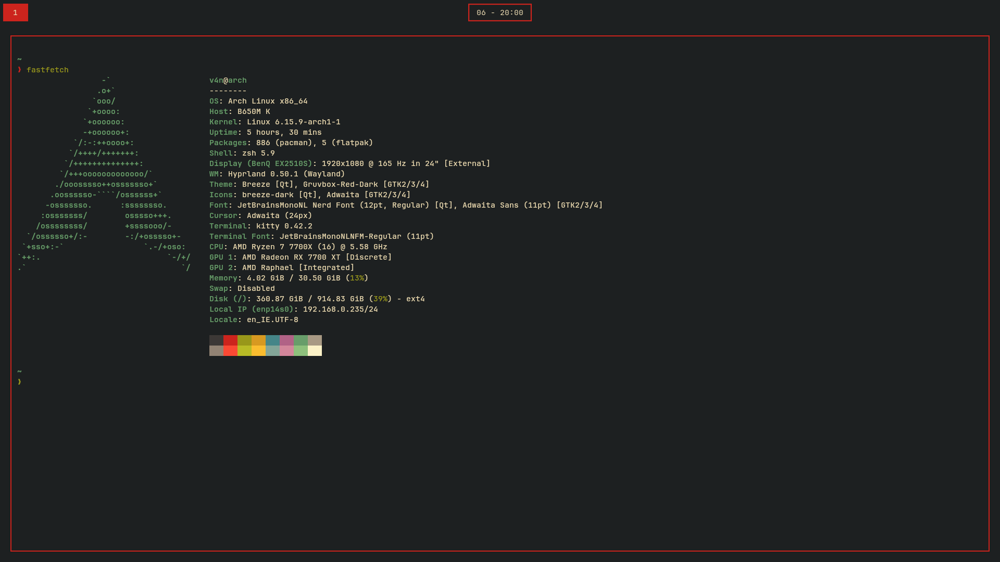

# dotfiles

This repository contains my dotfiles. I use [GNU Stow](https://www.gnu.org/software/stow/) to manage them.

## Information

- **OS**: [Arch Linux](https://archlinux.org/)
- **WM**: [Hyprland](https://hyprland.org/)
- **Terminal**: [Kitty](https://sw.kovidgoyal.net/kitty/)
- **Shell**: [Zsh](https://www.zsh.org/)
- **Editor**: [Neovim](https://neovim.io/)
- **Browser**: [Firefox](https://www.mozilla.org/en-US/firefox/)
- **Launcher**: [Tofi](https://github.com/philj56/tofi)
- **Bar**: [Waybar](https://github.com/Alexays/Waybar)
- **File Manager**: [Yazi](https://yazi-rs.github.io/)
- **Music Player**: [Cmus](https://cmus.github.io/)
- **Font**: [JetBrains Mono](https://www.jetbrains.com/lp/mono/)
- **Color Scheme**: [Gruvbox](https://github.com/morhetz/gruvbox)

## Preview

